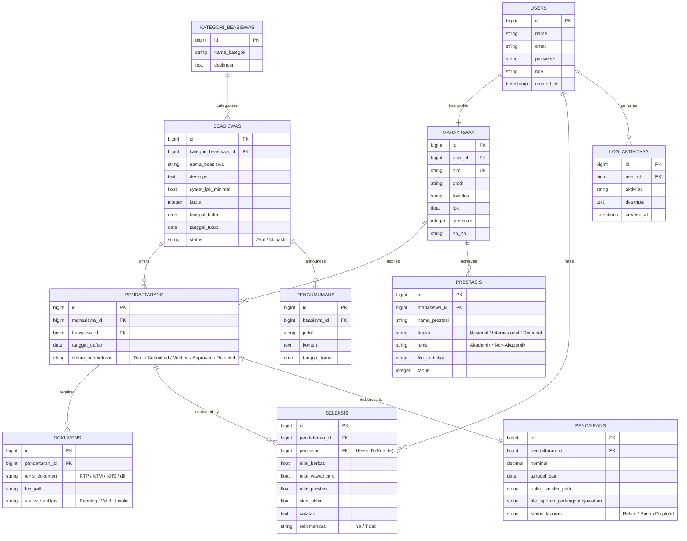

# Product Requirement Document (PRD)
## Sistem Informasi Manajemen Beasiswa (SIMB) – Kampus Unitama

| Atribut | Detail |
| :--- | :--- |
| **Nama Proyek** | Sistem Informasi Manajemen Beasiswa (SIMB) Kampus Unitama |
| **Status** | Draft (Ready for Review) |
| **Versi** | 1.0.0 |
| **Tanggal** | 30 Juni 2026 |
| **Penulis** | Senior Product Manager & Tech Lead |

---

## 1. Executive Summary & Visi Produk

### 1.1 Latar Belakang
Kampus Unitama berkomitmen untuk mendukung pemerataan pendidikan dan apresiasi prestasi mahasiswa melalui berbagai program beasiswa (prestasi, bantuan biaya, dan kemitraan). Namun, proses pengelolaan beasiswa saat ini masih bersifat semi-manual menggunakan spreadsheet dan pengumpulan berkas fisik. Hal ini mengakibatkan:
* Kerentanan hilangnya berkas fisik persyaratan.
* Kurangnya transparansi status seleksi bagi pendaftar.
* Beban administrasi yang tinggi bagi Komite Seleksi dalam melakukan verifikasi dokumen dan penilaian.
* Kesulitan dalam pelaporan riwayat pencairan beasiswa secara real-time.

### 1.2 Visi
Membangun platform **Sistem Informasi Manajemen Beasiswa (SIMB) Kampus Unitama** yang terintegrasi, transparan, dan efisien. Sistem ini akan mendigitalisasi seluruh rantai proses, mulai dari publikasi informasi, pendaftaran online, verifikasi berkas, penilaian komite, pengumuman hasil, hingga pelaporan pertanggungjawaban pasca-pencairan.

---

## 2. Pihak Terkait (User Personas & Roles)

Sistem ini mendukung 4 peran utama dengan hak akses spesifik:

1. **Mahasiswa (Pendaftar)**
   * Melihat daftar beasiswa aktif beserta persyaratannya.
   * Melakukan pendaftaran dan mengunggah dokumen persyaratan.
   * Mengisi riwayat akademik dan prestasi.
   * Memantau status kelulusan seleksi.
   * Mengunggah laporan pertanggungjawaban setelah beasiswa dicairkan.

2. **Staf Administrasi Akademik (Admin)**
   * Mengelola master data beasiswa (kuota, persyaratan, tanggal penting).
   * Memverifikasi keabsahan dokumen mahasiswa dan data akademik dasar.
   * Mengelola data akun pengguna.
   * Memproses data pencairan dana beasiswa.

3. **Komite Seleksi (Reviewer/Dosen)**
   * Melakukan penilaian kelayakan pendaftar (wawancara, portofolio, kecocokan berkas).
   * Memberikan skor/nilai akhir serta rekomendasi kelulusan.

4. **Pimpinan Kampus (Rektorat/Yayasan)**
   * Melihat dashboard statistik pendaftaran dan statistik penerimaan.
   * Memberikan persetujuan akhir (approval) hasil seleksi.
   * Memantau efektivitas anggaran pencairan beasiswa.

---

## 3. Spesifikasi Fitur Utama (Functional Requirements)

### FR-1: Informasi & Pendaftaran Beasiswa Online
* **Deskripsi**: Halaman publik untuk melihat program beasiswa yang sedang dibuka beserta detail syarat IPK minimal, semester minimal, dan kuota.
* **Alur**:
  1. Mahasiswa login ke sistem.
  2. Memilih program beasiswa aktif.
  3. Mengisi formulir pendaftaran digital yang mengambil data profil dasar mahasiswa secara otomatis.

### FR-2: Upload Dokumen Persyaratan
* **Deskripsi**: Unggah dokumen wajib (KTP, KTM, Kartu Hasil Studi (KHS), Surat Pernyataan Tidak Menerima Beasiswa Lain, dll).
* **Aturan Bisnis**:
  * Format file yang didukung: PDF, JPG, PNG.
  * Batas maksimal ukuran file: 2MB per file.
  * Fitur preview dokumen langsung di web untuk mempermudah verifikator.

### FR-3: Proses Seleksi oleh Komite
* **Deskripsi**: Panel penilaian bagi komite untuk mengevaluasi mahasiswa yang lolos tahap verifikasi administrasi.
* **Alur**:
  * Komite memberikan nilai pada 3 parameter: Nilai Berkas, Nilai Wawancara, dan Nilai Prestasi.
  * Sistem menghitung skor akhir berdasarkan bobot masing-masing parameter.
  * Komite memberikan rekomendasi status: "Direkomendasikan" atau "Tidak Direkomendasikan".

### FR-4: Manajemen Data Akademik Pendaftar
* **Deskripsi**: Sinkronisasi atau input data akademik utama mahasiswa seperti Program Studi, Fakultas, IPK Kumulatif, dan jumlah SKS yang telah ditempuh.
* **Aturan Bisnis**: Data IPK dan semester bersifat *read-only* bagi mahasiswa jika disinkronkan dengan SIAKAD (Sistem Informasi Akademik), atau diinput oleh Admin Akademik demi menjaga validitas data.

### FR-5: Pencatatan Prestasi Akademik & Non-Akademik
* **Deskripsi**: Modul bagi mahasiswa untuk menambahkan portofolio prestasi selama kuliah.
* **Aturan Bisnis**:
  * Setiap entri prestasi wajib menyertakan: Nama Kegiatan, Tingkat (Regional/Nasional/Internasional), Juara keberapa, Tahun, dan mengunggah Sertifikat Bukti.

### FR-6: Pencairan dan Laporan Beasiswa
* **Deskripsi**: Modul administrasi pencairan dana beasiswa dan pengunggahan laporan pertanggungjawaban oleh mahasiswa.
* **Alur**:
  1. Admin menginput tanggal pencairan, nominal, dan mengunggah bukti transfer bank.
  2. Status beasiswa mahasiswa berubah menjadi "Dicairkan".
  3. Mahasiswa wajib mengunggah Laporan Penggunaan Dana / Laporan Kemajuan Akademik (KHS terbaru) sebelum periode yang ditentukan berakhir.

### FR-7: Pengumuman Hasil Seleksi
* **Deskripsi**: Halaman khusus pengumuman kelulusan.
* **Alur**:
  * Pimpinan memberikan persetujuan akhir pada draf kelulusan.
  * Sistem mengubah status pendaftaran menjadi "Diterima" atau "Ditolak".
  * Mengirimkan notifikasi email otomatis ke mahasiswa dan menampilkan banner kelulusan pada dashboard mahasiswa.

---

## 4. Skema Data & Arsitektur

### 4.1 Penjelasan Naratif Relasi Data (Database Schema)

Sistem ini didesain menggunakan pendekatan database relasional dengan entitas sebagai berikut:

1. **`users`**: Menyimpan kredensial autentikasi dasar untuk semua entitas pengguna. Kolom `role` membedakan hak akses (`Mahasiswa`, `Admin`, `Komite`, `Pimpinan`).
2. **`mahasiswas`**: Menyimpan profil biodata spesifik mahasiswa dan data akademik utamanya (IPK, Semester, Program Studi). Entitas ini berelasi **1-to-1** dengan `users`.
3. **`kategori_beasiswas`**: Menyimpan kategori atau jenis beasiswa (misalnya: Beasiswa Prestasi, Beasiswa Bantuan Biaya/Kurang Mampu, Beasiswa Kemitraan). Berelasi **1-to-Many** dengan `beasiswas`.
4. **`beasiswas`**: Menyimpan master data program beasiswa yang dibuat oleh Admin, termasuk batasan IPK minimal, kuota penerima, rentang tanggal pendaftaran, dan terikat ke kategori tertentu.
5. **`pendaftarans`**: Entitas transaksi utama. Menghubungkan `mahasiswas` dengan `beasiswas` (**Many-to-Many** yang diurai menjadi asosiasi **1-to-Many**). Status pendaftaran dicatat di sini (e.g., `Draft`, `Submitted`, `Verified`, `Approved`, `Rejected`).
6. **`dokumens`**: Menyimpan file dokumen persyaratan yang diunggah oleh mahasiswa untuk pendaftaran tertentu. Berelasi **Many-to-1** dengan `pendaftarans`.
7. **`prestasis`**: Menyimpan data prestasi mahasiswa yang mendukung penilaian seleksi. Berelasi **Many-to-1** dengan `mahasiswas`.
8. **`seleksis`**: Menyimpan log penilaian dan skor yang diberikan oleh Komite Seleksi (`users` dengan role Komite). Berelasi **Many-to-1** dengan `pendaftarans`.
9. **`pencairans`**: Menyimpan catatan transaksi pengiriman dana beasiswa kepada mahasiswa yang lolos, serta file laporan pertanggungjawaban mahasiswa. Berelasi **1-to-1** dengan `pendaftarans`.
10. **`pengumumans`**: Berisi pengumuman publik atau spesifik terkait program beasiswa. Berelasi **Many-to-1** dengan `beasiswas`.
11. **`log_aktivitass`**: Menyimpan catatan log aktivitas audit (audit trail) tindakan penting yang dilakukan oleh seluruh pengguna di dalam sistem untuk transparansi. Berelasi **Many-to-1** dengan `users`.

---

### 4.2 Visualisasi Entity Relationship Diagram (ERD)

---

## 5. Kebutuhan Non-Fungsional (Non-Functional Requirements)

1. **Security (Keamanan)**:
   * Seluruh dokumen sensitif mahasiswa (KTP/Transkrip) disimpan di direktori storage yang tidak dapat diakses secara publik secara langsung (menggunakan *storage link secure route* atau *signed URL*).
   * Enkripsi password menggunakan algoritma bcrypt (default Laravel).
   * Proteksi terhadap kerentanan OWASP Top 10 (CSRF, SQL Injection, XSS).

2. **Performance & Scalability**:
   * Halaman harus memuat dalam waktu < 2 detik pada koneksi internet standar (3G/4G).
   * Sistem harus mampu menangani hingga 500 pengguna aktif simultan saat periode penutupan pendaftaran beasiswa.

3. **Usability (Kemudahan Penggunaan)**:
   * Antarmuka responsif yang ramah perangkat seluler (mobile-first design), mengingat mayoritas mahasiswa mengakses informasi via smartphone.
   * Panel Admin menggunakan tema **NiceAdmin Bootstrap** untuk kemudahan navigasi data tabular yang padat.

4. **Reliability**:
   * Ketersediaan sistem (Uptime) minimum 99.9%.
   * Backup database otomatis terjadwal setiap hari pada pukul 02:00 dini hari.
